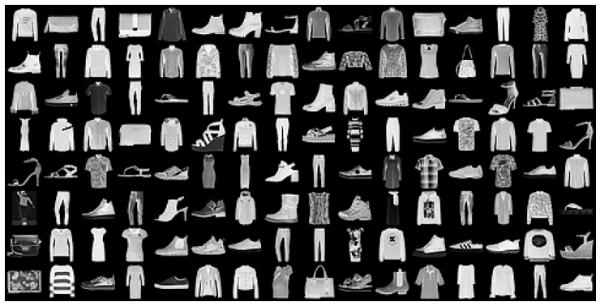
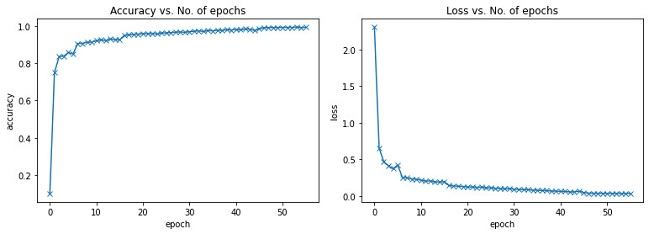
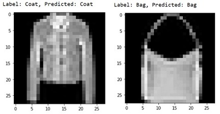
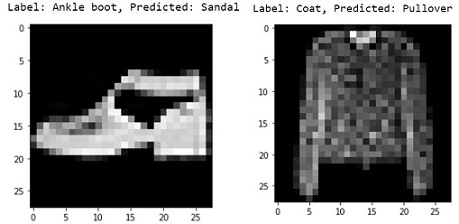

# Image Classification on Fashion MNIST Dataset using Feedforward Neural Network

## Description

*Fashion-MNIST* is a dataset of Zalando's article images consisting of a training set of 60,000 examples and a test set of 10,000 examples. Each image is a 28X28 grayscale image (total of 784 pixels), associated with a label from 10 classes. The labels of the images are as follows:
- 0 T-shirt/top
- 1 Trouser
- 2 Pullover
- 3 Dress
- 4 Coat
- 5 Sandal
- 6 Shirt
- 7 Sneaker
- 8 Bag
- 9 Ankle boot

## Data 

The dataset is downloaded from: [Github](https://github.com/zalandoresearch/fashion-mnist)

## Sample

Let us look at sample from this dataset for better understanding:

## Process

The training data was split into training data of 50,000 images and validation data of 10,000 images. A feedforward neural network with 5 hidden layers has been used to train this model. The optimizer used was SGD and ReLU activation function has been used for the model to learn non-linear patterns in data. I have also leveraged the use of GPU for faster computation.

The model is evaluated on the test dataset. 

## Results

The results have been satifying with a **90.3%** accuracy on the test dataset. The accuracy had been gradually increasing over time on validation data and also the loss had been gradually decreasing over time on validation data. Here are two plots to illustrate the accuracy and loss on validation dataset over time:

As the accuracy is not 100% and there are wrong predictions on around 10% of the images. Let us look at predictions by the model on the some images:

**Sample 1:**
 
 

The labels of the above two images have been correctly predicted by the model

**Sample 2:**
 
 

The labels of the above two images have been incorrectly predicted by the mode although the categories of its predicted when compared with that of the actual output are the same. A pull over is similar to a coat and same with the ankle boot and sandal.

## Software and Libraries

- [Torch](https://pytorch.org/)
- [Numpy](https://numpy.org/install/)
- [Matplotlib](https://matplotlib.org/stable/users/installing.html)

This project uses Python and some of its libraries for execution. You will also need to have software installed to run and execute a [Jupyter Notebook](https://jupyter.org/install).

It is highly recommended that you install the [Anaconda](https://www.anaconda.com/products/individual) distribution of Python, which already has the required packages included with it.

## References
- [Fashion-MNIST: a Novel Image Dataset for Benchmarking Machine Learning Algorithms](https://arxiv.org/abs/1708.07747)

## Authors
* **Kalyan Chirla**